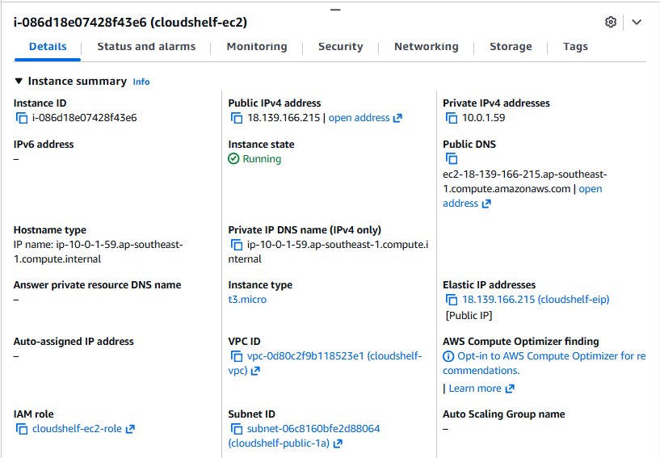

# CloudShelf — AWS Portfolio Project

Full-stack cloud application on AWS using free-tier resources only.

## Architecture Diagram

Internet
    │
    ▼
Internet Gateway (cloudshelf-igw)
    │
    ▼
Public Subnets (ap-southeast-1a, ap-southeast-1b)
    │
    ▼
EC2 (cloudshelf-sg-ec2)
    │  ports 80, 443, 22
    │
    ▼
Private Subnets (ap-southeast-1a, ap-southeast-1b)
    │
    ▼
RDS (cloudshelf-sg-rds)
    │  port 3306 from EC2 SG only

## Stack
VPC → IAM → EC2 → Docker → ECR → RDS → S3 → GitHub Actions → CloudWatch

## Architecture
- Custom VPC (10.0.0.0/16) in ap-southeast-1
- Dual-AZ public/private subnets
- Internet Gateway + public route table
- SG-based access control (EC2 and RDS security groups)
- Terraform remote state on S3

## Module Structure
terraform/
├── environments/dev/    # Dev environment entry point
└── modules/
└── vpc/             # VPC, subnets, IGW, route tables, SGs

## Security & Credentials

No hardcoded credentials exist in this repo.

- **EC2** authenticates to ECR and CloudWatch via IAM instance profile: the instance itself is the identity, no keys needed
- **GitHub Actions** authenticates to ECR via `cloudshelf-cicd` IAM user keys stored as GitHub Actions secrets — never committed to the repo
- **Local CLI** uses `cloudshelf-admin` IAM user configured via `aws configure`: never committed

## Phases
- [x] Phase 1 — VPC, Networking & Terraform Bootstrap
- [x] Phase 2 — IAM & Least Privilege
- [x] Phase 3 — EC2 & Linux Setup
- [ ] Phase 4 — App, Docker & ECR
- [ ] Phase 5 — RDS
- [ ] Phase 6 — Frontend S3
- [ ] Phase 7 — CI/CD GitHub Actions
- [ ] Phase 8 — CloudWatch
- [ ] Phase 9 — Terraform Consolidation