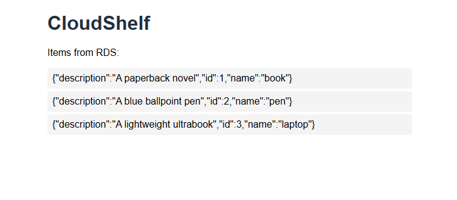

# CloudShelf - AWS Portfolio Project

Full-stack cloud application on AWS. All infrastructure in Terraform. Free tier only.

## Live Link
Frontend: http://cloudshelf-frontend-126104434582.s3-website-ap-southeast-1.amazonaws.com/

## Stack
VPC → IAM → EC2 → Docker → ECR → RDS → S3 → GitHub Actions → CloudWatch

## Architecture Diagram

Internet
    │
    ▼
S3 Static Frontend (cloudshelf-frontend)
    │  HTTP: fetches /items from EC2 Elastic IP directly
    ▼
Internet Gateway (cloudshelf-igw)
    │
    ▼
Public Subnets (ap-southeast-1a, ap-southeast-1b)
    │
    ▼
EC2 t3.micro (cloudshelf-sg-ec2)
    │  ports 80, 443 from internet
    │  port 22 from GitHub Actions + local IP
    │
    ├──→ ECR (Docker image pull via IAM instance profile)
    │
    ├──→ CloudWatch Logs (Docker + bootstrap logs)
    │         └── CPU Alarm → SNS → Email
    │
    ▼
RDS MySQL db.t3.micro (cloudshelf-sg-rds)
       port 3306 from EC2 SG only

## Module Structure

terraform/
├── environments/dev/       # Dev environment entry point
└── modules/
    ├── vpc/                # VPC, subnets, IGW, route tables, SGs
    ├── iam/                # IAM roles, policies, instance profile
    ├── compute/            # EC2, Elastic IP, ECR repository
    ├── rds/                # RDS MySQL instance, subnet group
    ├── frontend/           # S3 static hosting, bucket policy
    └── observability/      # CloudWatch log groups, metrics alarm, SNS

## Security & Credentials

I ensure that there are no hardcoded credentials exist anywhere in this repo or on any server.

| Identity | What it does | How it authenticates |
|---|---|---|
| EC2 instance profile | ECR pull, CloudWatch Logs write, metrics push | IAM role via instance metadata, no keys |
| `cloudshelf-cicd` IAM user | ECR push from GitHub Actions | Access keys stored as GitHub Actions secrets |
| `cloudshelf-admin` IAM user | Local AWS CLI during development | `aws configure` on local machine only, never committed |

## Challenges & Learnings

**Docker log permissions:** The CloudWatch agent (`cwagent` user) couldn't read 
Docker container logs due to root-restricted directory permissions. Fixed by running 
the agent as root. 

**IAM permissions discovered incrementally:** The EC2 role originally had minimal 
CloudWatch permissions. Installing the CloudWatch agent revealed three missing 
permissions (`logs:DescribeLogGroups`, `ec2:DescribeTags`, `cloudwatch:PutMetricData`) 
through agent error logs. I added incrementally.

**Terraform SG immutability:** Discovered that AWS security group names are immutable and 
attempting to rename via Terraform forces a destroy+recreate. Learned to plan 
naming conventions upfront and use `terraform plan` carefully before applying tag changes.

**EC2 bootstrap script debugging:** User data scripts fail silently. I learned to 
check `/var/log/cloud-init-output.log` and `/var/log/bootstrap.log` for errors 
rather than assuming the instance bootstrapped correctly.

## Architecture
- Custom VPC (10.0.0.0/16) in ap-southeast-1 with dual-AZ public/private subnets
- Internet Gateway + public route table, SG-based access control
- Flask API containerised with Docker (python:3.11-slim), deployed on EC2 via ECR
- RDS MySQL (db.t3.micro) restricted to EC2 SG only, no public access
- S3 static frontend with CORS-enabled Flask backend
- GitHub Actions CI/CD: build, push to ECR, deploy to EC2 on every push to main
- CloudWatch Logs agent shipping Docker stdout and bootstrap logs with 30-day retention
- Custom mem/disk metrics via CWAgent, CPU alarm with SNS email alerting
- Terraform remote state on S3 with native state locking

## Phases
- [x] Phase 1 — VPC, Networking & Terraform Bootstrap
- [x] Phase 2 — IAM & Least Privilege
- [x] Phase 3 — EC2 & Linux Setup
- [x] Phase 4 — App, Docker & ECR
- [x] Phase 5 — RDS
- [x] Phase 6 — Frontend S3
- [x] Phase 7 — CI/CD GitHub Actions
- [x] Phase 8 — CloudWatch
- [x] Phase 9 — Terraform Consolidation